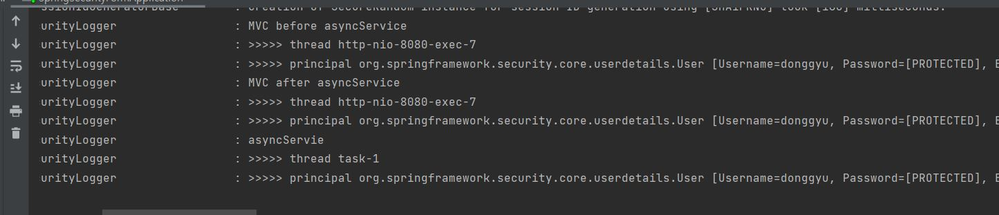
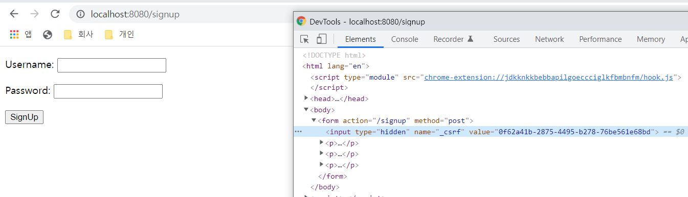

# Spring-security

## 스프링 시큐리티: 폼 인증
###
* 스프링 웹 프로젝트 만들기
> 1.spring init  
> 2.thyme, spring-security, spring-web  

* 스프링 시큐리티 연동
> 1.index.html 생성  
> 2.Controller 생성  
> 3.url 접속해보기  
> 4.security 의존성 추가 maven  
> 5.기존 접속하던 화면들이 로그인 화면으로 전환되는거 확인  
> 6.로그인 해보기
> >id : user, password: 로그 확인

* 스프링 시큐리티 설정하기
> 1.목표  
> index, info는 로그인 없이, dashboard는 로그인 사용자만 로그인 하지 않았다면 로그인 페이지로 이동되도록, admin은 ADMIN 권한자만 페이지 갈 수 있도록 설정  
>> 1.config package 생성 
>> 2.SecurityConfig class 생성 
>> 3.WebSecurityConfigureAdapter 상속받기, @EnableWebSecurity 설정  
>> 4.configure override 재정의

* 스프링 시큐리티 커스터마이징: 인메모리 유저 추가
> 1.목표  
> 자동으로 생성되는 로그인 유저가 아닌 내가 설정한 유저로 로그인하기, admin에게 ADMIN role 부여하기
>>1.로그를 잘 보면 UserDetailsServiceAutoConfiguration 에서 설정한다.
>>2.spring.security.user.name ,spring.security.user.password ,spring.security.user.roles 를 설정하면 된다는 것을 확인 할 수 있다. 

> 2.목표  
> donggyu 유저를 만들고 USER 권한주기, donggyu 유저는 dashboard는 접근하지만 admin은 접근하지 못하는 것 확인
> >1.AuthenticationManagerBuilder 매개변수로 가진 configure 재정의

* 스프링 시큐리티 커스터마이징: JPA 연동
> 1.목표  
> jpa를 통해 유저를 데이터베이스에서 읽어오도록 변경하자.
> >1.maven jpa와 h2 추가  
> >2.model 패키지 추가  
> >3.Account Entity 생성  id, username, password, role   
> >4.repository 패키지 추가  
> >5.AccountRepository class 생성, findByUsername method 생성 
> >6.service 패키지 추가  
> >7.AccountService class 생성  
> >UserDetailsService 상속, loadUserByUsername method 재정의  
> > >loadUserByUsername의 역할은 UserDetails 반환
> >
> >8.inmemory 사용 주석  
> >9.AccountController 생성, user를 저장할 수 있도록 생성
> >>주의사항!!! password 형태는 '{noop}패스워드' 이여야 한다.

* 스프링 시큐리티 커스터마이징: PasswordEncoder
> 1.목표  
> PasswordEncoder bean 생성
> >1.main 메소드에 PasswordEncoder 등록  
> >예전에는 {noop}를 사용했으나 여러 이유로 포맷이 교체되었다고 한다.
> 

* 스프링 시큐리티 테스트 1부
> 1.목표  
> index_anonymous 테스트
> > 유저가 없을 때 index 접근하였을 때 status ok인지 확인
>
> index_donggyu 테스트
> > donggyu 유저가 index 접근하였을 때 status ok인지 확인
>
> admin_donggyu 테스트
> > donggyu 유저가 admin 접근하였을 때 status forbidden 확인
> 
> admin_admin 테스트
> > admin 유저가 admin 접근하였을 때 status ok 인지 확인

> 2.목표  
> @WithAnonymousUser  
> @WithMockUser(username = "donggyu", roles = "USER") 사용해보기  
> @WithCustomUser annotation 생성 후 @WithMockUser(username = "donggyu", roles = "USER") 주입

* 스프링 시큐리티 테스트 2부
> 1.목표  
> 로그인 테스트
> > login_success 테스트  
> >> before 로그인 생성 service 저장 후 로그인 성공  
> >
> > login_fail 테스트  
> >> 잘못된 로그인 정보로 로그인 시 로그인 실패 테스트  

## 스프링 시큐리티: 아키텍처
* SecurityContextHolder와 Authentication
> 1.소제목  
> 2.소제목  

* AuthenticationManager와 Authentication
> 1.소제목  
> 2.소제목  

## 웹 애플리케이션 시큐리티
* 스프링 시큐리티 ignoring() 1부
> 1.목표  
> static 한 리소스 요청에 대해 ignore 설정 (예 : /favicon.io)  
> > WebSecurity web을 매개변수로 가지는 configure 메소드 재정의

* 스프링 시큐리티 ignoring() 2부
> 팁 : static 한 리소스 요청에 대해 ignore에 설정하지 않고 authorizeHttpRequests에 
> permitAll로 설정하는건 좋지 못하다. 왜냐하면 모두 인증을 통과하기는 하지만 filter 로직을 수행하기 때문이다.  
> 팁 : 왠만하면 동적 리소스는 permitAll()에 거는게 좋다.

* Async 웹 MVC를 지원하는 필터: WebAsyncManagerIntegrationFilter
> 1.목표  
>> async 한 상태에 대해서도 SecurityContext가 공유되고 있음을 확인하기
> >> 1.log 패키지 생성, SecurityLogger class 생성
> >>
> >> 2.SecurityLogger log 메소드 생성 (매개변수 message, thread 이름 찍기, principal 정보 찍기)
> >>
> >> 3.Controller에서 async-handler 요청을 받아서 Callbable<String> 반환하기(log 메소드로 mvc내에서와 callable 내에서 다름을 확인)
> 

* 스프링 시큐리티와 @Async
> 1.목표  
> async 한 서비스에서의 Principal 정보 확인하기 (principal이 공유되지 않음)  
> > 1.AccountSerivce에 ayncService 만들기 (@Async)  
> > 2.@Async를 사용하기 위해 SpringSecurityFormApplication에 @EnableAsync 설정  
> > 3.Controller /async-service 처리하고 service 앞,뒤, 안에 로그 찍기
>
> 2.목표  
> 위의 공유되지 않은 pricipal 정보를 공유시킬 수 있도록 설정 변경해보기.  
> configure에서 SecurityContextHolder.setStrategyName(SecurityContextHolder.MODE_INHERITABLETHREADLOCAL);
>
> 

* SecurityContext 영속화 필터: SecurityContextPersistenceFilter
> 기능 : SecurityContext를 유지하게 해주는 필터, login 한 뒤 다시 /dashboard를 요청하면 로그인하지 않아도 된다.
> 만약 추가적인 filter를 등록할 것이라면 SecurityContextPersistenceFilter 우선순위 뒤에 와야 한다.
> 그래야 영속적인 유지가 가능하다.
> 기본적인 구현체는 HttpSessionSecurityContextRepository이다.

* 시큐리티 관련 헤더 추가하는 필터: HeaderWriterFilter
> 1.헤더에 대한 필터를 적용할 수 있게 해 준다. (예 : https만 허용)  
> 2.나중에 필요한 상황이 오면 강의를 한 번 더 보도록 하자.

* CSRF 어택 방지 필터: CsrfFilter
> 1.요청이 들어오면 client에 csrf 토큰을 발행해준다. 화면에서 hidden으로 csrf 토큰이 있음 
> 강의 정리 필요

* CSRF 토큰 사용 예제
> 1.목표  
> 회원가입 페이지에서 _csrf 값 확인해보기
> > 1.SignupController 만들기 @GetMapping, PostMapping으로 회원가입 처리  
> > 2.html은 복사

> 포스트맨으로 요청하면 _csrf값이 없어서 401 error가 난다.

> 2.목표  
> 회원가입페이지로 가면 응답으로 _csrf가 포함되어 있는 테스트코드 작성
> 회원가입요청 시 csrf 없는 요청 실패 테스트 작성
> 회원가입요청 시 csrf 포함 요청 성공 테스트 작성

